# Carry Chain at 703 Megahertz

**Physical design log — Intel AMX `TDPBSSD` on Nangate45**

Ten synthesis-and-place-and-route experiments on a 1,024-multiplier INT8 tile matrix-multiply unit, run as a disciplined hillclimb. The design ended up limited by a multiplier's carry-propagate adder. Along the way the experiment log discovered that its own headline metric had been measuring the wrong thing for eight consecutive trials.

| | |
|---|---|
| Design | `amx_tdpbssd` |
| Operation | `C += A×B`, (16×64)×(64×16) INT8 |
| MACs | 16,384 per instruction |
| Flow | Yosys + OpenROAD, Nangate45 |
| Trials | 10 |
| RTL defects | 0 |

> A styled standalone version with the same content is at [`report.html`](report.html) — download and open it locally; GitHub shows HTML as source.

## Headline

| | value | |
|---|---|---|
| Operating point | **698.9 MHz** | at 1.40 ns, 2.436 W |
| Wall | **702.9 MHz** | 26% more power buys +4.0 MHz |
| Power, one register | **19.2×** | 19.00 W → 0.99 W at equal speed |
| Rows misreported | **4 / 10** | limited by pad boundary, not by the design |
| Tooling defects | **12** | against zero RTL defects |

## What the metric got wrong

Frequency was computed as `1000 / (target − worst slack)`. That describes the hardware only when the limiting path runs register to register. The timing constraints budget chip I/O as *20% of the clock period*, so a path ending at an output pad is charged a slice of budget that **shrinks as the target tightens** — and the reported frequency rises with byte-identical hardware. Four of these ten rows were limited that way.

Each trial below shows the figure as originally reported and, where they differ, the corrected register-to-register figure. The correction was recovered from routed databases still on disk, and every recovered slack matched its logged value to within 0.002 ns — which is what makes it a correction rather than a guess. Nothing had to be re-measured.

## The five designs

*Same datapath. The question was only where to cut it.*

Every trial is one of these five netlists measured at some clock target. The chain from operand select to accumulator is fixed; what each pipeline level changes is where a register boundary falls, and therefore how much logic has to settle within one cycle. The accumulate loop cannot be cut — a saturating add must read its own previous result — so it sets the floor no pipeline depth can go below.

In each diagram, a **filled** boundary is a register that exists at that level; a **dashed grey** one is a boundary that is still combinational.

### PIPE=0 — one combinational path

`24,584 flip-flops` · measured in X1·Y0

Nothing between the mux and the accumulator. Every k-step selects operands, multiplies 1,024 products, sums them, adds 33 bits and clamps — all inside one clock. Glitches from the mux propagate through the entire depth, which is why this variant burns 19 W.

```mermaid
flowchart LR
  T["a_flat / b_flat<br/>tiles - 16,384 ff"] --> MUX["16:1 MUX<br/>select k-step"]
  MUX --> R3["S3<br/>combinational"]
  R3 --> MUL["8x8 MUL<br/>x4 per unit"]
  MUL --> R2["S2<br/>combinational"]
  R2 --> TREE["Sum tree<br/>4:1, 18b exact"]
  TREE --> R1["S1<br/>combinational"]
  R1 --> ADD["+33b then FOLD<br/>clamp INT32"]
  ADD --> CACC["cacc<br/>32b x 256 = 8,192 ff"]
  CACC -.->|"loop: irreducible"| ADD
  CACC --> RMUX["5-level MUX<br/>row select"]
  RMUX --> RD["RD<br/>combinational"]
  RD --> PORT["rd_data<br/>512b output port"]
  class R3,R2,R1,RD regoff
  class T,PORT edge
  classDef regon fill:#12879B,stroke:#12879B,color:#ffffff
  classDef regoff fill:transparent,stroke:#8A97A6,stroke-dasharray:4 3,color:#8A97A6
  classDef edge fill:transparent,stroke:#8A97A6,stroke-dasharray:2 2
```

### PIPE=1 — register sum4

`29,194 flip-flops` · measured in X1·Y1, X2·Y0

One boundary at S1 removes the mux, the multiply *and* the adder tree from the accumulate path in a single move, for 4,608 flops. The cheapest large cut available, and the one that cut power 19×.

```mermaid
flowchart LR
  T["a_flat / b_flat<br/>tiles - 16,384 ff"] --> MUX["16:1 MUX<br/>select k-step"]
  MUX --> R3["S3<br/>combinational"]
  R3 --> MUL["8x8 MUL<br/>x4 per unit"]
  MUL --> R2["S2<br/>combinational"]
  R2 --> TREE["Sum tree<br/>4:1, 18b exact"]
  TREE --> R1["S1<br/>4,608 ff"]
  R1 --> ADD["+33b then FOLD<br/>clamp INT32"]
  ADD --> CACC["cacc<br/>32b x 256 = 8,192 ff"]
  CACC -.->|"loop: irreducible"| ADD
  CACC --> RMUX["5-level MUX<br/>row select"]
  RMUX --> RD["RD<br/>combinational"]
  RD --> PORT["rd_data<br/>512b output port"]
  class R1 regon
  class R3,R2,RD regoff
  class T,PORT edge
  classDef regon fill:#12879B,stroke:#12879B,color:#ffffff
  classDef regoff fill:transparent,stroke:#8A97A6,stroke-dasharray:4 3,color:#8A97A6
  classDef edge fill:transparent,stroke:#8A97A6,stroke-dasharray:2 2
```

### PIPE=2 — also register the products

`45,579 flip-flops` · measured in X2·Y1, X2·Y3

S2 splits the multiply from the tree. By far the most expensive rung: 16,384 flops, two thirds of the tile register file, for +100.6 MHz.

```mermaid
flowchart LR
  T["a_flat / b_flat<br/>tiles - 16,384 ff"] --> MUX["16:1 MUX<br/>select k-step"]
  MUX --> R3["S3<br/>combinational"]
  R3 --> MUL["8x8 MUL<br/>x4 per unit"]
  MUL --> R2["S2<br/>16,384 ff"]
  R2 --> TREE["Sum tree<br/>4:1, 18b exact"]
  TREE --> R1["S1<br/>4,608 ff"]
  R1 --> ADD["+33b then FOLD<br/>clamp INT32"]
  ADD --> CACC["cacc<br/>32b x 256 = 8,192 ff"]
  CACC -.->|"loop: irreducible"| ADD
  CACC --> RMUX["5-level MUX<br/>row select"]
  RMUX --> RD["RD<br/>combinational"]
  RD --> PORT["rd_data<br/>512b output port"]
  class R2,R1 regon
  class R3,RD regoff
  class T,PORT edge
  classDef regon fill:#12879B,stroke:#12879B,color:#ffffff
  classDef regoff fill:transparent,stroke:#8A97A6,stroke-dasharray:4 3,color:#8A97A6
  classDef edge fill:transparent,stroke:#8A97A6,stroke-dasharray:2 2
```

### PIPE=3 — also register the mux outputs

`46,604 flip-flops` · measured in X2·Y2, X2·Y4

S3 splits the 16:1 mux off the front of the multiply for only 1,024 flops — the cheapest cut in the ladder and worth +117.6 MHz at equal target. It also made the design 62,648 cells *smaller*, because repair buffering collapsed once the stage was short enough not to need forcing into shape.

```mermaid
flowchart LR
  T["a_flat / b_flat<br/>tiles - 16,384 ff"] --> MUX["16:1 MUX<br/>select k-step"]
  MUX --> R3["S3<br/>1,024 ff"]
  R3 --> MUL["8x8 MUL<br/>x4 per unit"]
  MUL --> R2["S2<br/>16,384 ff"]
  R2 --> TREE["Sum tree<br/>4:1, 18b exact"]
  TREE --> R1["S1<br/>4,608 ff"]
  R1 --> ADD["+33b then FOLD<br/>clamp INT32"]
  ADD --> CACC["cacc<br/>32b x 256 = 8,192 ff"]
  CACC -.->|"loop: irreducible"| ADD
  CACC --> RMUX["5-level MUX<br/>row select"]
  RMUX --> RD["RD<br/>combinational"]
  RD --> PORT["rd_data<br/>512b output port"]
  class R3,R2,R1 regon
  class RD regoff
  class T,PORT edge
  classDef regon fill:#12879B,stroke:#12879B,color:#ffffff
  classDef regoff fill:transparent,stroke:#8A97A6,stroke-dasharray:4 3,color:#8A97A6
  classDef edge fill:transparent,stroke:#8A97A6,stroke-dasharray:2 2
```

### PIPE=3 + RD_REG — register the readback

`47,116 flip-flops` · measured in X3·Y0, X4·Y0, X4·Y1

Not a datapath change. The readback mux had become the critical path, running combinationally from an input pin to an output pin with no register to cancel clock insertion delay against. RD places a flop after the mux for 512 flops, costing one cycle of readback latency and no throughput.

```mermaid
flowchart LR
  T["a_flat / b_flat<br/>tiles - 16,384 ff"] --> MUX["16:1 MUX<br/>select k-step"]
  MUX --> R3["S3<br/>1,024 ff"]
  R3 --> MUL["8x8 MUL<br/>x4 per unit"]
  MUL --> R2["S2<br/>16,384 ff"]
  R2 --> TREE["Sum tree<br/>4:1, 18b exact"]
  TREE --> R1["S1<br/>4,608 ff"]
  R1 --> ADD["+33b then FOLD<br/>clamp INT32"]
  ADD --> CACC["cacc<br/>32b x 256 = 8,192 ff"]
  CACC -.->|"loop: irreducible"| ADD
  CACC --> RMUX["5-level MUX<br/>row select"]
  RMUX --> RD["RD<br/>512 ff"]
  RD --> PORT["rd_data<br/>512b output port"]
  class R3,R2,R1,RD regon
  class T,PORT edge
  classDef regon fill:#12879B,stroke:#12879B,color:#ffffff
  classDef regoff fill:transparent,stroke:#8A97A6,stroke-dasharray:4 3,color:#8A97A6
  classDef edge fill:transparent,stroke:#8A97A6,stroke-dasharray:2 2
```

## The trials

### Generation X1 — Read the slack. Blame the one combinational path. Fix by pipelining.

Period held **fixed at 2.80 ns** across the whole generation, so every rung is compared on equal footing. That discipline was correct in intent and produced the generation's central failure: a fixed period saturates the measurement, and a saturated measurement reports the target rather than the design.

#### X1·Y0 — Re-baseline, no RTL change

`PIPE=0` `RD_REG=0` `target 2.80 ns` · design-limited

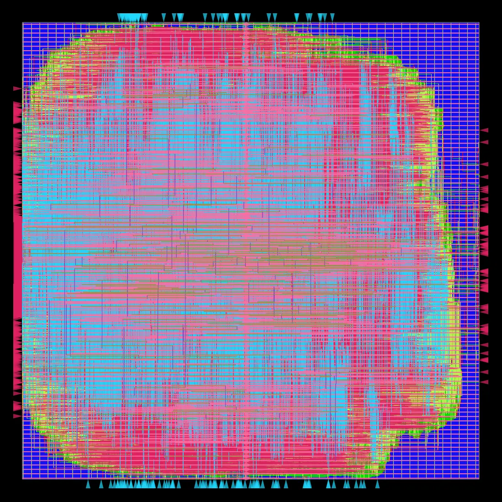

*Routed die, all layers — 1,086,640 µm², 509,176 cells. Pink and cyan are the lower metal layers, green the vias; blue is unused routing track.*

**What was tried.** Establish a comparison point before touching anything. The previous measurement violated *hold* at −0.0349 ns over 34 endpoints — a min-delay failure that no clock period can fix. X1 treated hold as a harness knob rather than an RTL problem and set the tool's `HOLD_SLACK_MARGIN` to 0.05 ns. Period fixed at 2.80 ns, derived from the measured need, and held constant for every trial in the generation.

**Result.** Hold closed completely — 34 violations to zero — with **no RTL change at all**. It was a repair-effort problem, not a design problem. The whole design is one combinational path: `kcnt` through a 16:1 mux, 1024 multipliers, the adder trees, a 33-bit add and the saturating fold, into the accumulator. That shows up in the power number, and nobody looked at it for eight more trials.

| fmax | reg→reg slack | TNS | power | flip-flops | std cells | hold | DRC |
|---|---|---|---|---|---|---|---|
| **350.1 MHz** | -0.0565 ns | -35.96 | 19.001 W | 24,584 | 509,176 | +0.0399 | 0 |

#### X1·Y1 — PIPE=1 — and the row the metric could not see

`PIPE=1` `RD_REG=0` `target 2.80 ns` · design-limited

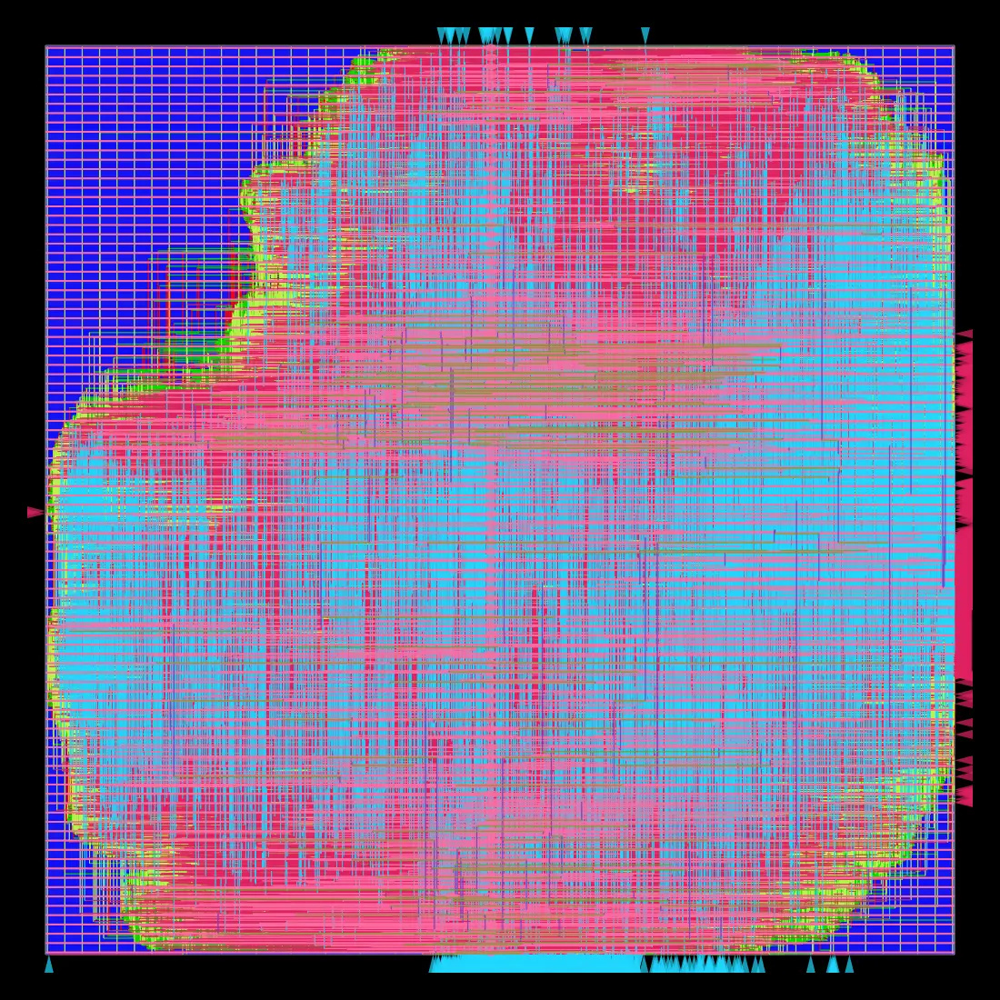

*Routed die, all layers — 920,220 µm², 457,390 cells. Pink and cyan are the lower metal layers, green the vias; blue is unused routing track.*

**What was tried.** The same change, now actually built: one pipeline register after `sum4`, verified identical in simulation and synthesis.

**Result.** By the number X1 was watching, this row was **flat** — frequency moved 0.3 MHz and the generation was declared exhausted. That reading was correct about its own metric and wrong about the design. At the same target and the same speed, power fell from 19.00 W to 0.99 W: a **19.2× reduction**, with 10% fewer cells and 15% less area. One register truncated glitch propagation through 1024 multipliers that had been toggling repeatedly before settling every cycle. The win was sitting in a file the harness had already parsed.

| fmax | reg→reg slack | TNS | power | flip-flops | std cells | hold | DRC |
|---|---|---|---|---|---|---|---|
| **350.4 MHz** | -0.0539 ns | -0.76 | 0.992 W | 29,194 | 457,390 | +0.0402 | 0 |

> This run appears twice in the log. The flow succeeded, but the script was edited while bash was part-way through executing it, so it resumed at a shifted byte offset and the logging step was destroyed after 61 minutes of completed work. The record was then recovered from these very artifacts in zero seconds, once the script grew a flag for exactly that. Separately: the 19x power win was noticed at close, not at the time. A hillclimb that ranks on one scalar cannot see a Pareto move.

### Generation X2 — Same blame, same fix. Change the procedure.

Target derived per trial from the previous row's measured need; total negative slack read as the saturation signal. This recovered a 15.6% gain that X1 had recorded as “flat” — but two of its five rows were secretly limited by pad-boundary paths, which nothing it read could reveal.

#### X2·Y0 — Same RTL, honest target

`PIPE=1` `RD_REG=0` `target 2.00 ns` · design-limited

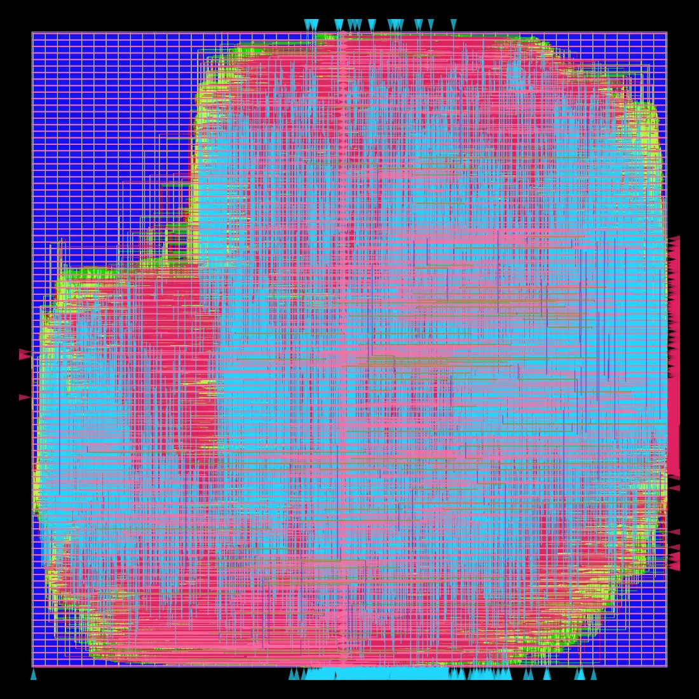

*Routed die, all layers — 971,277 µm², 492,398 cells. Pink and cyan are the lower metal layers, green the vias; blue is unused routing track.*

**What was tried.** No RTL change. X1's fixed 2.80 ns period was the suspect: total negative slack had been only −0.8 ns, meaning the tool met its target and stopped optimising. If the measurement was saturated, the “flat” row was an artifact of the period. Re-measure the identical netlist at 2.00 ns.

**Result.** `PIPE=1` was worth **+54.7 MHz**, not +0.3. The fix family had worked all along; the procedure had hidden it. From here on, total negative slack is read as the saturation signal before any row is called flat.

| fmax | reg→reg slack | TNS | power | flip-flops | std cells | hold | DRC |
|---|---|---|---|---|---|---|---|
| **404.8 MHz** | -0.4702 ns | -1067.83 | 1.483 W | 29,194 | 492,398 | +0.0227 | 0 |

#### X2·Y1 — PIPE=2 — split the multiply from the tree

`PIPE=2` `RD_REG=0` `target 1.80 ns` · design-limited

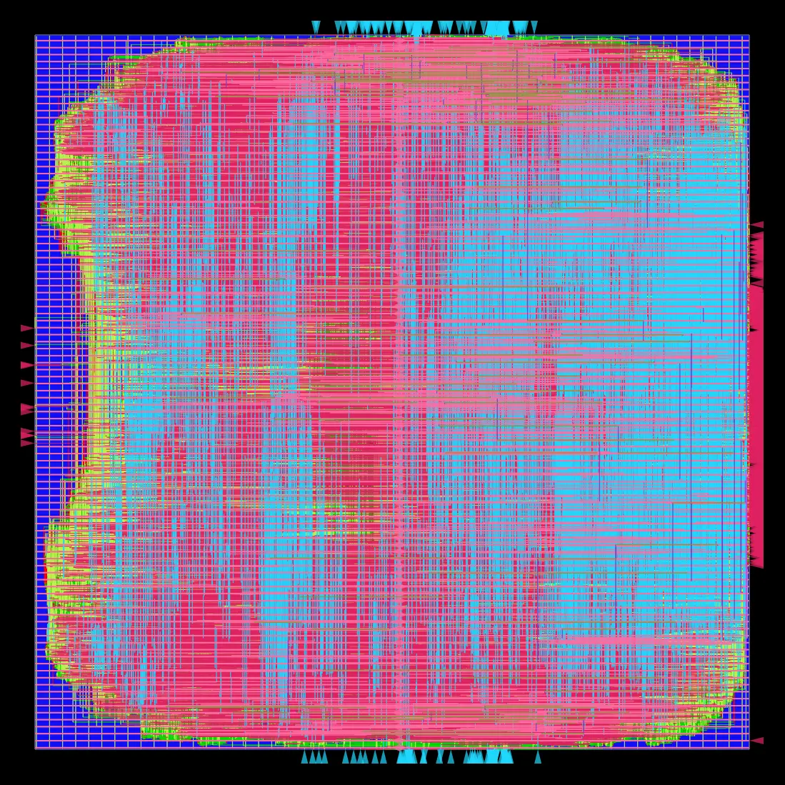

*Routed die, all layers — 1,074,080 µm², 577,348 cells. Pink and cyan are the lower metal layers, green the vias; blue is unused routing track.*

**What was tried.** Also register the raw products, adding 16,384 flops — by far the most expensive rung. Target derived from the previous row's measured need.

**Result.** **+77.9 MHz.** Larger than the previous rung, which contradicted the prediction written before the run: gate count had been used as a proxy for logic depth, and depth is what a clock period actually pays for.

| fmax | reg→reg slack | TNS | power | flip-flops | std cells | hold | DRC |
|---|---|---|---|---|---|---|---|
| **482.7 MHz** | -0.2717 ns | -906.03 | 1.893 W | 45,579 | 577,348 | +0.0353 | 0 |

#### X2·Y2 — PIPE=3 — and a number that was measuring the wrong thing

`PIPE=3` `RD_REG=0` `target 1.80 ns` · **pad-limited**

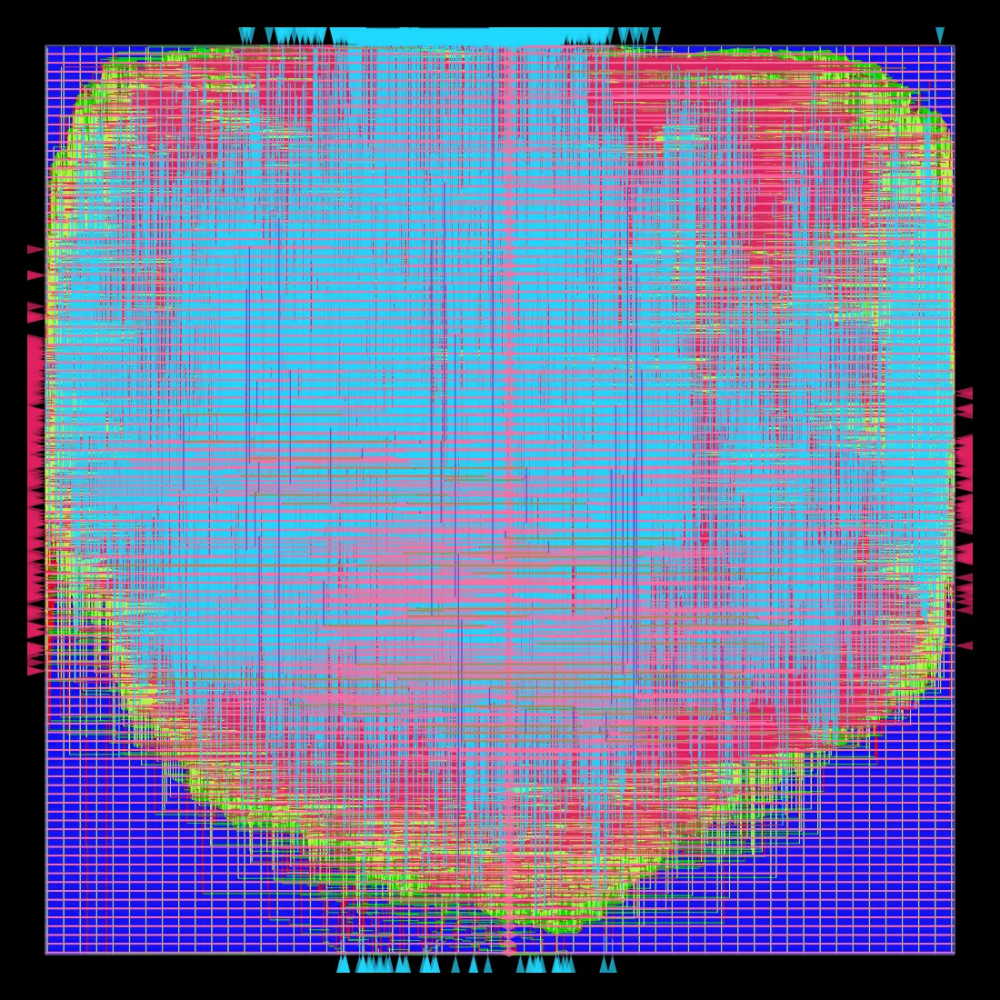

*Routed die, all layers — 1,021,570 µm², 514,700 cells. Pink and cyan are the lower metal layers, green the vias; blue is unused routing track.*

**What was tried.** Register the selected operands too, splitting the 16:1 mux from the multiply for only 1,024 more flops. Same 1.80 ns target as the previous rung, so the comparison is clean.

**Result.** Reported at 511.4 MHz — and that figure is **wrong**. The limiting path here runs from an input port through the readback mux straight to an output port, never touching a register. The timing constraints charge such a path 40% of the clock period plus uncertainty as pad-boundary budget: **46% of the period spent on modelling assumptions**, not logic. The compute datapath had already met its target with 0.134 ns to spare. The real figure is **600.3 MHz**, recovered nine months of trials later. `PIPE=3` was undersold by roughly 90 MHz, and every later decision about it used the wrong number.

| fmax | reg→reg slack | TNS | power | flip-flops | std cells | hold | DRC |
|---|---|---|---|---|---|---|---|
| **600.3 MHz** (reported ~~511.4~~) | +0.1341 ns | -31.58 | 1.956 W | 46,604 | 514,700 | +0.0329 | 0 |

> Also: adding 1,025 flops made the design 62,648 cells SMALLER. Repair buffering collapsed from 127,433 to 65,593 once the stage was short enough not to need forcing into shape.

#### X2·Y3 — Is PIPE=2 effort-limited?

`PIPE=2` `RD_REG=0` `target 1.50 ns` · design-limited

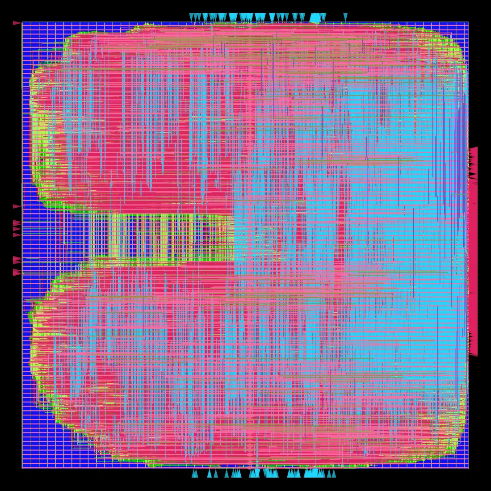

*Routed die, all layers — 1,081,950 µm², 583,132 cells. Pink and cyan are the lower metal layers, green the vias; blue is unused routing track.*

**What was tried.** Re-measure `PIPE=2` at 1.50 ns. Its earlier number came from a run with very large negative slack, meaning the optimiser was still finding improvements when it stopped. If frequency rises purely from asking harder, then no absolute figure in this project is a property of the design.

**Result.** **+22.7 MHz from asking harder alone.** The tool works *to* its target, so every frequency here is a lower bound, and rows measured at different targets are not comparable. This is the finding that made the later correction possible — and the one the campaign kept failing to apply.

| fmax | reg→reg slack | TNS | power | flip-flops | std cells | hold | DRC |
|---|---|---|---|---|---|---|---|
| **505.4 MHz** | -0.4788 ns | -3549.78 | 2.296 W | 45,579 | 583,132 | +0.0236 | 0 |

#### X2·Y4 — PIPE=3 at a tighter target

`PIPE=3` `RD_REG=0` `target 1.60 ns` · **pad-limited**

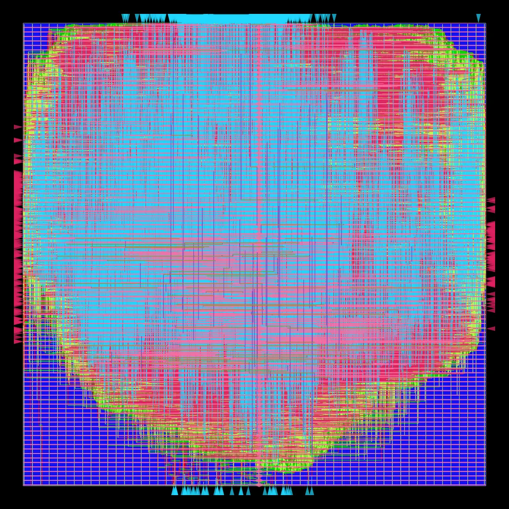

*Routed die, all layers — 1,029,960 µm², 519,051 cells. Pink and cyan are the lower metal layers, green the vias; blue is unused routing track.*

**What was tried.** Push `PIPE=3` to 1.60 ns to find its own limit.

**Result.** Reported at 514.9 MHz, and recorded at the time as beating the earlier `PIPE=3` row. It did not. Both figures were I/O-limited, at different targets, so the comparison was meaningless in both directions. Corrected: **643.3 MHz**, with the compute datapath again meeting its target — this time with 0.046 ns spare. The worst path was a flop driving five levels of readback mux out to a pin, 47% of its delay being clock insertion that cannot cancel because an output port has no capture flop.

| fmax | reg→reg slack | TNS | power | flip-flops | std cells | hold | DRC |
|---|---|---|---|---|---|---|---|
| **643.3 MHz** (reported ~~514.9~~) | +0.0456 ns | -114.64 | 2.217 W | 46,604 | 519,051 | +0.0285 | 0 |

### Generation X3 — Read the path, not just the number.

The slack says how much you missed by; the path says what to change. Reading it named the readback port as the limiter, the fix worked — and following up on a wrong prediction is what exposed that the headline metric had been inflated for eight trials.

#### X3·Y0 — Register the readback port

`PIPE=3` `RD_REG=1` `target 1.60 ns` · **pad-limited**

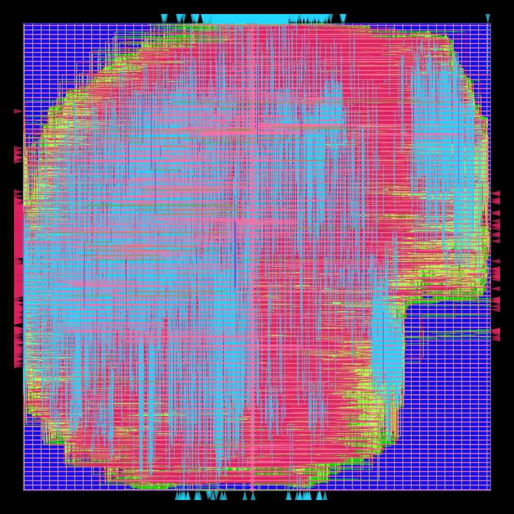

*Routed die, all layers — 1,029,030 µm², 522,690 cells. Pink and cyan are the lower metal layers, green the vias; blue is unused routing track.*

**What was tried.** Read the *path*, not just the slack — the change that defines this generation. The report named the readback port explicitly, so `RD_REG=1` puts a flop after the readback mux, converting an uncancellable port path into flop→mux→flop. Costs one cycle of readback latency, not throughput. Same 1.60 ns target: one variable.

**Result.** Total negative slack collapsed **8,900×**, from −114.6 to −0.013 ns, and area and power both *fell* while 512 flops were added. The flop prediction was exact to the flop. But the path did not move where predicted — it stayed on the readback port, just shorter, still 64% clock insertion delay. Chasing that discrepancy is what exposed the metric defect: pad budget scales with the period, so tightening the target inflates the reported frequency with *identical hardware*. Four of ten rows were affected. Real figure: **658.7 MHz**.

| fmax | reg→reg slack | TNS | power | flip-flops | std cells | hold | DRC |
|---|---|---|---|---|---|---|---|
| **658.7 MHz** (reported ~~620.8~~) | +0.0818 ns | -0.01 | 2.098 W | 47,116 | 522,690 | +0.0307 | 0 |

> Every past trial was corrected from artifacts already on disk. Recovered slack matched each logged value within 0.002 ns, which is what made the correction legitimate rather than a guess.

### Generation X4 — Establish the limiter before proposing a fix for it.

Limiter class recorded before any frequency is quoted; each variant iterated to its own fixed point. The generation then *refuted its own premise* and closed without building the RTL change it was created to build.

#### X4·Y0 — Test the premise before building anything

`PIPE=3` `RD_REG=1` `target 1.40 ns` · **pad-limited**

*Routed die, all layers — 1,046,050 µm², 532,445 cells. Pink and cyan are the lower metal layers, green the vias; blue is unused routing track.*

**What was tried.** X4 blamed the multiplier's carry-propagate adder and proposed carry-save arithmetic to fix it. But that path had *positive* slack — it had never once been observed to fail, so the blame was unfalsified rather than confirmed. Spend this trial on a measurement instead: identical RTL, target tightened to 1.40 ns.

**Result.** **+40.2 MHz with no RTL change.** The carry chain was merely effort-limited, not at its wall. Building carry-save would have spent roughly 16,000 flops — 35% of the design — optimising a path that was not binding. Both timing predictions written before this run were wrong, including the model of the pad-budget artifact itself: the output path's delay is not period-independent, since the tool shortens that too when pushed.

| fmax | reg→reg slack | TNS | power | flip-flops | std cells | hold | DRC |
|---|---|---|---|---|---|---|---|
| **698.9 MHz** (reported ~~682.8~~) | -0.0309 ns | -1.56 | 2.436 W | 47,116 | 532,445 | +0.0386 | 0 |

> This trial exists only because the previous one taught that a positive-slack path is not evidence of a limit.

#### X4·Y1 — Find the wall

`PIPE=3` `RD_REG=1` `target 1.20 ns` · design-limited

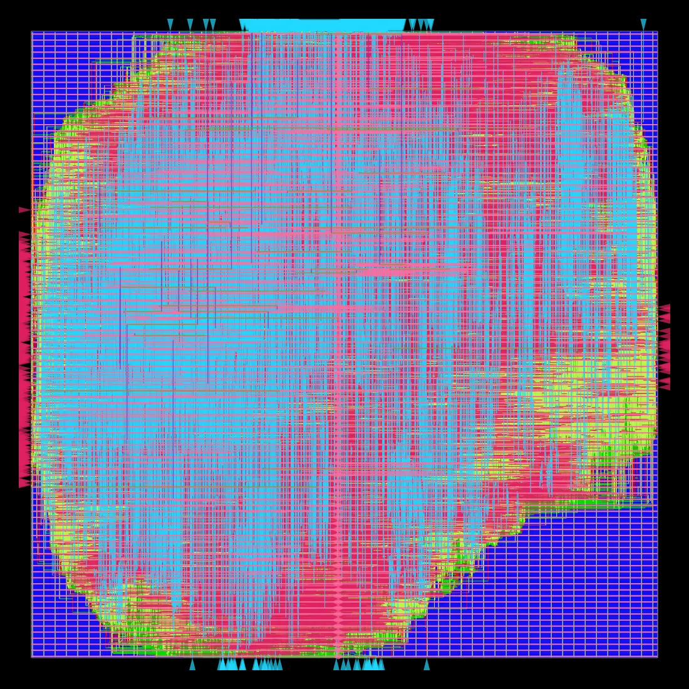

*Routed die, all layers — 1,088,150 µm², 567,769 cells. Pink and cyan are the lower metal layers, green the vias; blue is unused routing track.*

**What was tried.** Keep tightening the same RTL to 1.20 ns. The stopping condition was written down in advance: *large total negative slack together with a stalled objective* means a real limit; a small one means the tool simply met its target again.

**Result.** The condition fired exactly as specified. Total negative slack blew up **357×** while the objective moved **+4.0 MHz**, and the limiter finally flipped from the pad boundary to a genuine register-to-register path. The wall is **~703 MHz**. The cost of those last four megahertz was 26% more power and 35,324 more cells — which is what closed the campaign: past 1.40 ns, power is the price and frequency is not the return.

| fmax | reg→reg slack | TNS | power | flip-flops | std cells | hold | DRC |
|---|---|---|---|---|---|---|---|
| **702.9 MHz** | -0.2226 ns | -558.27 | 3.069 W | 47,116 | 567,769 | +0.0330 | 0 |

> The binding path is the multiplier's final carry-propagate adder, ending at bit 14 of a 16-bit product, where carries arrive last.

## Every trial, in one table

| Trial | PIPE / RD | Target | Limiter | Reported | Corrected | reg→reg slack | TNS | Power | Flops | Cells | DRC |
|---|---|---|---|---|---|---|---|---|---|---|---|
| X1·Y0 | 0 / 0 | 2.80 | design | 350.1 | **350.1** | -0.0565 | -35.96 | 19.001 | 24,584 | 509,176 | 0 |
| X1·Y1 | 1 / 0 | 2.80 | — | ~~no row~~ | — | — | — | — | — | — | — |
| X1·Y1 | 1 / 0 | 2.80 | design | 350.4 | **350.4** | -0.0539 | -0.76 | 0.992 | 29,194 | 457,390 | 0 |
| X2·Y0 | 1 / 0 | 2.00 | design | 404.8 | **404.8** | -0.4702 | -1067.83 | 1.483 | 29,194 | 492,398 | 0 |
| X2·Y1 | 2 / 0 | 1.80 | design | 482.7 | **482.7** | -0.2717 | -906.03 | 1.893 | 45,579 | 577,348 | 0 |
| X2·Y2 | 3 / 0 | 1.80 | pad | ~~511.4~~ | **600.3** | +0.1341 | -31.58 | 1.956 | 46,604 | 514,700 | 0 |
| X2·Y3 | 2 / 0 | 1.50 | design | 505.4 | **505.4** | -0.4788 | -3549.78 | 2.296 | 45,579 | 583,132 | 0 |
| X2·Y4 | 3 / 0 | 1.60 | pad | ~~514.9~~ | **643.3** | +0.0456 | -114.64 | 2.217 | 46,604 | 519,051 | 0 |
| X3·Y0 | 3 / 1 | 1.60 | pad | ~~620.8~~ | **658.7** | +0.0818 | -0.01 | 2.098 | 47,116 | 522,690 | 0 |
| X4·Y0 | 3 / 1 | 1.40 | pad | ~~682.8~~ | **698.9** | -0.0309 | -1.56 | 2.436 | 47,116 | 532,445 | 0 |
| X4·Y1 | 3 / 1 | 1.20 | design | 703.0 | **702.9** | -0.2226 | -558.27 | 3.069 | 47,116 | 567,769 | 0 |

## What the campaign is entitled to claim

Only trials run at the same target are directly comparable, because the tool optimises *to* whatever target it is given. Three such pairs exist: the third pipeline stage was worth **+117.6 MHz** at 1.80 ns, registering the readback port **+15.4 MHz** at 1.60 ns, and the first pipeline stage +0.3 MHz at 2.80 ns — alongside its 19.2× power reduction.

The end-to-end 350 → 699 MHz figure spans two different targets, and the starting point was itself not saturated, so the design's true capability at the low end was never measured. **That headline is indicative, not a measurement**, and it overstates the gain by an unknown amount. Closing the log does not license the number the broken metric would have produced.

## The pattern across all ten trials

Every flip-flop-count prediction written before a run was exact. Almost every timing prediction was wrong — including which path would become critical, which rung would gain most, and the model of the measurement artifact itself. That asymmetry is the argument for writing predictions down before the run rather than reasoning about results afterwards: structural claims about what gets built are reliable, and claims about what the optimiser will do with it are not.

Twelve defects were found in how the design was measured. Zero were found in the design. The RTL has been correct at every pipeline depth since it was written.

---

> The hillclimb ranked on one number, so it could not see a Pareto move. It called a row flat on 0.3 MHz while holding a nineteen-fold power win in a file it had already read.

*Generated by [`scripts/report.py`](../scripts/report.py) from [`trials.jsonl`](trials.jsonl). Every figure is read from the flow's own reports; none is hand-typed.*
