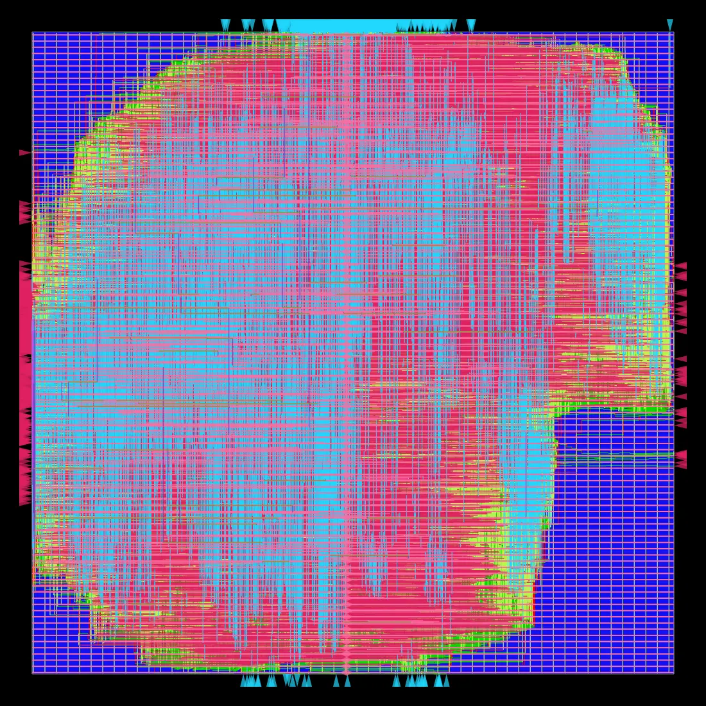

# Carry Chain at 703 Megahertz

**Physical design log — Intel AMX `TDPBSSD` on Nangate45**

Ten synthesis-and-place-and-route experiments on a 1,024-multiplier INT8 tile matrix-multiply unit, run as a disciplined hillclimb. Four generations of method, ten routed designs, and a final result that runs at twice the baseline frequency for 7.8 times less power. The design ends up limited by a multiplier's carry-propagate adder.

| | |
|---|---|
| Design | `amx_tdpbssd` |
| Operation | `C += A×B`, (16×64)×(64×16) INT8 |
| MACs | 16,384 per instruction |
| Flow | Yosys + OpenROAD, Nangate45 |
| Trials | 10 |
| RTL defects | 0 |

> A styled HTML version of this page can be built locally with `python3 scripts/report.py` — it is not committed, because GitHub renders HTML as source and this Markdown is the shareable form.

## The final chip

*The final design, routed — 1,046,050 µm², 532,445 standard cells, 47,116 flip-flops, hold met, DRC clean. Pink and cyan are the lower metal layers, green the vias; blue is unused routing track. The cell region does not fill the die because the floorplan targets 40% utilisation.*

### Baseline vs final

| | Baseline — X1·Y0 | Final — X4·Y0 | Change |
|---|---|---|---|
| Design | PIPE=0, one combinational path | PIPE=3 + RD_REG | 3 pipeline cuts |
| Clock target | 2.80 ns | 1.40 ns | −50% |
| **fmax, reg→reg** | 350.1 MHz | **698.9 MHz** | **+99.6%** |
| **Power** | 19.001 W | **2.436 W** | **-87.2% · 7.8× less** |
| Flip-flops | 24,584 | 47,116 | +91.7% |
| Standard cells | 509,176 | 532,445 | +4.6% |
| Die area | 1,086,640 µm² | 1,046,050 µm² | -3.7% |
| Hold slack | +0.0399 ns | +0.0386 ns | met both |
| DRC violations | 0 | 0 | clean both |
| **Streamed throughput** | 358.5 GMAC/s | **715.7 GMAC/s** | **+99.6%** |
| **Energy efficiency** | 18.9 GMAC/s/W | **293.8 GMAC/s/W** | **15.6× better** |

**Twice the speed for 7.8× less power**, at +4.6% more cells. Read the fmax row with one caveat: the two rows were placed and routed at different clock targets, and the tool optimises *to* whatever target it is given, so that percentage is indicative rather than a like-for-like measurement. The power figures are measured at each row's own operating condition, and most of that reduction was won at equal speed and equal target.

The wall is 702.9 MHz. Going there costs 26% more power for +4.0 MHz, which is why 1.40 ns is the operating point and not 1.20.

## Does the arithmetic actually get faster?

*Cycles per instruction grow 17 to 20. Throughput still doubles.*

A fair objection to any pipelining ladder: each stage inserts a register, so one instruction passes through more clock edges. The testbench asserts exactly that — an operation takes `17 + PIPE` cycles, verified on every run — so the baseline finishes in 17 cycles and the final design needs 20, **17.6% more**. If frequency had risen by less than that, the design would compute more slowly while looking faster.

It did not, and the reason is what `PIPE` costs. A pipeline register adds *latency*, not cycles per k-step: the array still retires **1,024 MACs on every clock edge** at every depth, because that is the multiplier count and the accumulate loop runs one k-step per cycle regardless. So the extra cycles are pipeline fill, paid once per instruction rather than once per k-step. Streamed work amortises them to nothing.

| Variant | Target | fmax | Cycles | Latency | One instruction | Streamed | Efficiency |
|---|---|---|---|---|---|---|---|
| PIPE=0 | 2.80 ns | 350.1 MHz | 17 | 48.56 ns | 337.4 | **358.5** | **18.9** |
| PIPE=1 | 2.00 ns | 404.8 MHz | 18 | 44.47 ns | 368.5 | **414.5** | **279.4** |
| PIPE=2 | 1.50 ns | 505.4 MHz | 19 | 37.59 ns | 435.8 | **517.5** | **225.4** |
| PIPE=3 | 1.60 ns | 643.3 MHz | 20 | 31.09 ns | 527.0 | **658.7** | **297.2** |
| PIPE=3 + RD_REG | 1.60 ns | 658.7 MHz | 20 | 30.36 ns | 539.6 | **674.5** | **321.4** |
| PIPE=3 + RD_REG | 1.40 ns ← operating point | 698.9 MHz | 20 | 28.62 ns | 572.5 | **715.7** | **293.8** |
| PIPE=3 + RD_REG | 1.20 ns | 702.9 MHz | 20 | 28.45 ns | 575.8 | **719.8** | **234.5** |

Columns: **One instruction** is GMAC/s for a single isolated `TDPBSSD`, 16,384 MACs divided by its full latency, so it pays the pipeline fill in full. **Streamed** is GMAC/s once the fill is amortised, which is 1,024 MACs per cycle times the clock. **Efficiency** is streamed GMAC/s per watt.

| | Baseline — X1·Y0 | Final — X4·Y0 | Change |
|---|---|---|---|
| Cycles per instruction | 17 | 20 | +17.6% |
| One instruction | 337.4 GMAC/s | **572.5 GMAC/s** | **+69.7%** |
| Streamed | 358.5 GMAC/s | **715.7 GMAC/s** | **+99.6%** |
| Efficiency | 18.9 GMAC/s/W | **293.8 GMAC/s/W** | **15.6× better** |

One isolated instruction gains the +99.6% clock less the 17.6% the extra cycles take back. Streamed throughput tracks frequency exactly, because the registers cost nothing per k-step. Efficiency compounds the frequency gain with the power reduction.

Efficiency is **not** monotonic, and it does not peak where throughput does. The best measured figure is **321.4 GMAC/s per watt at 1.60 ns**, one target looser than the operating point: tightening from there to 1.40 ns buys **+6.1% streamed throughput for -8.6% efficiency**, because the extra frequency is paid for with timing-repair cells that burn power. **If energy per MAC is the objective rather than throughput, 1.60 ns is the better target.** The wall at 1.20 ns is worse than 1.40 on both counts — it exists to prove where the limit is, not to be shipped.

## The five designs

*Same datapath. The question was only where to cut it.*

Every trial is one of these five netlists measured at some clock target. The chain from operand select to accumulator is fixed; what each pipeline level changes is where a register boundary falls, and therefore how much logic has to settle within one cycle. The accumulate loop cannot be cut — a saturating add must read its own previous result — so it sets the floor no pipeline depth can go below.

In each diagram, a **filled** boundary is a register that exists at that level; a **dashed grey** one is a boundary that is still combinational.

### PIPE=0 — one combinational path

`24,584 flip-flops` · measured in X1·Y0

Nothing between the mux and the accumulator. Every k-step selects operands, multiplies 1,024 products, sums them, adds 33 bits and clamps — all inside one clock. Glitches from the mux propagate through the entire depth, which is why this variant burns 19 W.

```mermaid
flowchart LR
  T["a_flat / b_flat<br/>tiles - 16,384 ff"] --> MUX["16:1 MUX<br/>select k-step"]
  MUX --> R3["S3<br/>combinational"]
  R3 --> MUL["8x8 MUL<br/>x4 per unit"]
  MUL --> R2["S2<br/>combinational"]
  R2 --> TREE["Sum tree<br/>4:1, 18b exact"]
  TREE --> R1["S1<br/>combinational"]
  R1 --> ADD["+33b then FOLD<br/>clamp INT32"]
  ADD --> CACC["cacc<br/>32b x 256 = 8,192 ff"]
  CACC -.->|"loop: irreducible"| ADD
  CACC --> RMUX["5-level MUX<br/>row select"]
  RMUX --> RD["RD<br/>combinational"]
  RD --> PORT["rd_data<br/>512b output port"]
  class R3,R2,R1,RD regoff
  class T,PORT edge
  classDef regon fill:#12879B,stroke:#12879B,color:#ffffff
  classDef regoff fill:transparent,stroke:#8A97A6,stroke-dasharray:4 3,color:#8A97A6
  classDef edge fill:transparent,stroke:#8A97A6,stroke-dasharray:2 2
```

### PIPE=1 — register sum4

`29,194 flip-flops` · measured in X1·Y1, X2·Y0

One boundary at S1 removes the mux, the multiply *and* the adder tree from the accumulate path in a single move, for 4,608 flops. The cheapest large cut available, and the one that cut power 19×.

```mermaid
flowchart LR
  T["a_flat / b_flat<br/>tiles - 16,384 ff"] --> MUX["16:1 MUX<br/>select k-step"]
  MUX --> R3["S3<br/>combinational"]
  R3 --> MUL["8x8 MUL<br/>x4 per unit"]
  MUL --> R2["S2<br/>combinational"]
  R2 --> TREE["Sum tree<br/>4:1, 18b exact"]
  TREE --> R1["S1<br/>4,608 ff"]
  R1 --> ADD["+33b then FOLD<br/>clamp INT32"]
  ADD --> CACC["cacc<br/>32b x 256 = 8,192 ff"]
  CACC -.->|"loop: irreducible"| ADD
  CACC --> RMUX["5-level MUX<br/>row select"]
  RMUX --> RD["RD<br/>combinational"]
  RD --> PORT["rd_data<br/>512b output port"]
  class R1 regon
  class R3,R2,RD regoff
  class T,PORT edge
  classDef regon fill:#12879B,stroke:#12879B,color:#ffffff
  classDef regoff fill:transparent,stroke:#8A97A6,stroke-dasharray:4 3,color:#8A97A6
  classDef edge fill:transparent,stroke:#8A97A6,stroke-dasharray:2 2
```

### PIPE=2 — also register the products

`45,579 flip-flops` · measured in X2·Y1, X2·Y3

S2 splits the multiply from the tree. By far the most expensive rung: 16,384 flops, two thirds of the tile register file, for +100.6 MHz.

```mermaid
flowchart LR
  T["a_flat / b_flat<br/>tiles - 16,384 ff"] --> MUX["16:1 MUX<br/>select k-step"]
  MUX --> R3["S3<br/>combinational"]
  R3 --> MUL["8x8 MUL<br/>x4 per unit"]
  MUL --> R2["S2<br/>16,384 ff"]
  R2 --> TREE["Sum tree<br/>4:1, 18b exact"]
  TREE --> R1["S1<br/>4,608 ff"]
  R1 --> ADD["+33b then FOLD<br/>clamp INT32"]
  ADD --> CACC["cacc<br/>32b x 256 = 8,192 ff"]
  CACC -.->|"loop: irreducible"| ADD
  CACC --> RMUX["5-level MUX<br/>row select"]
  RMUX --> RD["RD<br/>combinational"]
  RD --> PORT["rd_data<br/>512b output port"]
  class R2,R1 regon
  class R3,RD regoff
  class T,PORT edge
  classDef regon fill:#12879B,stroke:#12879B,color:#ffffff
  classDef regoff fill:transparent,stroke:#8A97A6,stroke-dasharray:4 3,color:#8A97A6
  classDef edge fill:transparent,stroke:#8A97A6,stroke-dasharray:2 2
```

### PIPE=3 — also register the mux outputs

`46,604 flip-flops` · measured in X2·Y2, X2·Y4

S3 splits the 16:1 mux off the front of the multiply for only 1,024 flops — the cheapest cut in the ladder and worth +117.6 MHz at equal target. It also made the design 62,648 cells *smaller*, because repair buffering collapsed once the stage was short enough not to need forcing into shape.

```mermaid
flowchart LR
  T["a_flat / b_flat<br/>tiles - 16,384 ff"] --> MUX["16:1 MUX<br/>select k-step"]
  MUX --> R3["S3<br/>1,024 ff"]
  R3 --> MUL["8x8 MUL<br/>x4 per unit"]
  MUL --> R2["S2<br/>16,384 ff"]
  R2 --> TREE["Sum tree<br/>4:1, 18b exact"]
  TREE --> R1["S1<br/>4,608 ff"]
  R1 --> ADD["+33b then FOLD<br/>clamp INT32"]
  ADD --> CACC["cacc<br/>32b x 256 = 8,192 ff"]
  CACC -.->|"loop: irreducible"| ADD
  CACC --> RMUX["5-level MUX<br/>row select"]
  RMUX --> RD["RD<br/>combinational"]
  RD --> PORT["rd_data<br/>512b output port"]
  class R3,R2,R1 regon
  class RD regoff
  class T,PORT edge
  classDef regon fill:#12879B,stroke:#12879B,color:#ffffff
  classDef regoff fill:transparent,stroke:#8A97A6,stroke-dasharray:4 3,color:#8A97A6
  classDef edge fill:transparent,stroke:#8A97A6,stroke-dasharray:2 2
```

### PIPE=3 + RD_REG — register the readback

`47,116 flip-flops` · measured in X3·Y0, X4·Y0, X4·Y1

Not a datapath change. The readback mux had become the critical path, running combinationally from an input pin to an output pin with no register to cancel clock insertion delay against. RD places a flop after the mux for 512 flops, costing one cycle of readback latency and no throughput.

```mermaid
flowchart LR
  T["a_flat / b_flat<br/>tiles - 16,384 ff"] --> MUX["16:1 MUX<br/>select k-step"]
  MUX --> R3["S3<br/>1,024 ff"]
  R3 --> MUL["8x8 MUL<br/>x4 per unit"]
  MUL --> R2["S2<br/>16,384 ff"]
  R2 --> TREE["Sum tree<br/>4:1, 18b exact"]
  TREE --> R1["S1<br/>4,608 ff"]
  R1 --> ADD["+33b then FOLD<br/>clamp INT32"]
  ADD --> CACC["cacc<br/>32b x 256 = 8,192 ff"]
  CACC -.->|"loop: irreducible"| ADD
  CACC --> RMUX["5-level MUX<br/>row select"]
  RMUX --> RD["RD<br/>512 ff"]
  RD --> PORT["rd_data<br/>512b output port"]
  class R3,R2,R1,RD regon
  class T,PORT edge
  classDef regon fill:#12879B,stroke:#12879B,color:#ffffff
  classDef regoff fill:transparent,stroke:#8A97A6,stroke-dasharray:4 3,color:#8A97A6
  classDef edge fill:transparent,stroke:#8A97A6,stroke-dasharray:2 2
```

## The trials

### Generation X1 — Read the slack. Blame the one combinational path. Fix by pipelining.

Period held **fixed at 2.80 ns** across the whole generation so every rung is compared on equal footing. The limitation of that choice shows up immediately: a target the tool comfortably meets measures the target, not the design, so a real gain can register as no gain at all.

#### X1·Y0 — Re-baseline, no RTL change

`PIPE=0` `RD_REG=0` `target 2.80 ns` · design-limited

**What was tried.** Establish a comparison point before touching anything. The previous measurement violated *hold* at −0.0349 ns over 34 endpoints — a min-delay failure that no clock period can fix. X1 treated hold as a harness knob rather than an RTL problem and set the tool's `HOLD_SLACK_MARGIN` to 0.05 ns. Period fixed at 2.80 ns, derived from the measured need, and held constant for every trial in the generation.

**Result.** Hold closed completely — 34 violations to zero — with **no RTL change at all**. It was a repair-effort problem, not a design problem. The whole design is one combinational path: `kcnt` through a 16:1 mux, 1024 multipliers, the adder trees, a 33-bit add and the saturating fold, into the accumulator. That shows up in the power number, and nobody looked at it for eight more trials.

| fmax | reg→reg slack | TNS | power | flip-flops | std cells | hold | DRC |
|---|---|---|---|---|---|---|---|
| **350.1 MHz** | -0.0565 ns | -35.96 | 19.001 W | 24,584 | 509,176 | +0.0399 | 0 |

#### X1·Y1 — PIPE=1 — and the row the metric could not see

`PIPE=1` `RD_REG=0` `target 2.80 ns` · design-limited

**What was tried.** The same change, now actually built: one pipeline register after `sum4`, verified identical in simulation and synthesis.

**Result.** Frequency barely moved — 0.3 MHz at this target. **Power fell 19.2×**, from 19.00 W to 0.99 W, with 10% fewer cells and 15% less area, at the same speed and the same target. One register truncates glitch propagation through 1,024 multipliers that had been toggling repeatedly before settling every cycle. The pipelining ladder's real payoff is here, not in the clock.

| fmax | reg→reg slack | TNS | power | flip-flops | std cells | hold | DRC |
|---|---|---|---|---|---|---|---|
| **350.4 MHz** | -0.0539 ns | -0.76 | 0.992 W | 29,194 | 457,390 | +0.0402 | 0 |

> The single most valuable change in the campaign, and it is invisible in a frequency number.

### Generation X2 — Same blame, same fix. Change the procedure.

Target derived per trial from the previous row's measured need, and total negative slack read as the saturation signal — small means the tool met its goal and stopped, large means it was still finding improvements. That change alone recovered a 15.6% gain the fixed-period generation had recorded as flat.

#### X2·Y0 — Same RTL, honest target

`PIPE=1` `RD_REG=0` `target 2.00 ns` · design-limited

**What was tried.** No RTL change. X1's fixed 2.80 ns period was the suspect: total negative slack had been only −0.8 ns, meaning the tool met its target and stopped optimising. If the measurement was saturated, the “flat” row was an artifact of the period. Re-measure the identical netlist at 2.00 ns.

**Result.** `PIPE=1` was worth **+54.7 MHz**, not +0.3. The fix family had worked all along; the procedure had hidden it. From here on, total negative slack is read as the saturation signal before any row is called flat.

| fmax | reg→reg slack | TNS | power | flip-flops | std cells | hold | DRC |
|---|---|---|---|---|---|---|---|
| **404.8 MHz** | -0.4702 ns | -1067.83 | 1.483 W | 29,194 | 492,398 | +0.0227 | 0 |

#### X2·Y1 — PIPE=2 — split the multiply from the tree

`PIPE=2` `RD_REG=0` `target 1.80 ns` · design-limited

**What was tried.** Also register the raw products, adding 16,384 flops — by far the most expensive rung. Target derived from the previous row's measured need.

**Result.** **+77.9 MHz** — a larger gain than the previous rung, despite registering products rather than sums. Logic depth, not gate count, is what a clock period pays for.

| fmax | reg→reg slack | TNS | power | flip-flops | std cells | hold | DRC |
|---|---|---|---|---|---|---|---|
| **482.7 MHz** | -0.2717 ns | -906.03 | 1.893 W | 45,579 | 577,348 | +0.0353 | 0 |

#### X2·Y2 — PIPE=3 — the cheapest cut, and the limit moves off the arithmetic

`PIPE=3` `RD_REG=0` `target 1.80 ns` · **pad-limited**

**What was tried.** Register the selected operands too, splitting the 16:1 mux from the multiply for only 1,024 more flops. Same 1.80 ns target as the previous rung, so the comparison is clean.

**Result.** **600.3 MHz**, and the compute datapath met its target with 0.134 ns to spare — so at this clock the limit was no longer the arithmetic but the readback path out to the pins, which runs combinationally from an input port through the mux to an output port with no register to absorb clock insertion delay. That is the observation X3 was created to act on.

| fmax | reg→reg slack | TNS | power | flip-flops | std cells | hold | DRC |
|---|---|---|---|---|---|---|---|
| **600.3 MHz** | +0.1341 ns | -31.58 | 1.956 W | 46,604 | 514,700 | +0.0329 | 0 |

> Adding 1,025 flops made the design 62,648 cells SMALLER. Repair buffering collapsed from 127,433 to 65,593 once the stage was short enough not to need forcing into shape.

#### X2·Y3 — Is PIPE=2 effort-limited?

`PIPE=2` `RD_REG=0` `target 1.50 ns` · design-limited

**What was tried.** Re-measure `PIPE=2` at 1.50 ns. Its earlier number came from a run with very large negative slack, meaning the optimiser was still finding improvements when it stopped. If frequency rises purely from asking harder, then no absolute figure in this project is a property of the design.

**Result.** **+22.7 MHz from asking harder alone.** The tool works *to* its target, so every frequency in this report is a lower bound, and only rows sharing a target are directly comparable. Worth knowing before reading any single number as the design's capability.

| fmax | reg→reg slack | TNS | power | flip-flops | std cells | hold | DRC |
|---|---|---|---|---|---|---|---|
| **505.4 MHz** | -0.4788 ns | -3549.78 | 2.296 W | 45,579 | 583,132 | +0.0236 | 0 |

#### X2·Y4 — PIPE=3 at a tighter target

`PIPE=3` `RD_REG=0` `target 1.60 ns` · **pad-limited**

**What was tried.** Push `PIPE=3` to 1.60 ns to find its own limit.

**Result.** **643.3 MHz**, with the compute datapath again meeting its target — this time with 0.046 ns spare. The worst path is a flop driving five levels of readback mux out to a pin, and 47% of its delay is clock insertion that cannot cancel, because an output port has no capture flop to cancel it against. Same limiter as the previous row, now measured precisely enough to fix.

| fmax | reg→reg slack | TNS | power | flip-flops | std cells | hold | DRC |
|---|---|---|---|---|---|---|---|
| **643.3 MHz** | +0.0456 ns | -114.64 | 2.217 W | 46,604 | 519,051 | +0.0285 | 0 |

### Generation X3 — Read the path, not just the number.

The slack says how much you missed by; the path says what to change. Reading it named the readback port — not the arithmetic — as the thing standing between this design and its target, which no amount of further pipelining would have fixed.

#### X3·Y0 — Register the readback port

`PIPE=3` `RD_REG=1` `target 1.60 ns` · **pad-limited**

**What was tried.** Read the *path*, not just the slack — the change that defines this generation. The report named the readback port explicitly, so `RD_REG=1` puts a flop after the readback mux, converting an uncancellable port path into flop→mux→flop. Costs one cycle of readback latency, not throughput. Same 1.60 ns target: one variable.

**Result.** **658.7 MHz.** Total negative slack collapsed **8,900×**, from −114.6 to −0.013 ns, and area and power both *fell* while 512 flops were added. The design now closes at 1.60 ns where before it missed by 0.34. The residual worst path is still the readback pin — shorter now, but 64% of its delay is clock insertion, which is a pad-boundary property no RTL change reaches.

| fmax | reg→reg slack | TNS | power | flip-flops | std cells | hold | DRC |
|---|---|---|---|---|---|---|---|
| **658.7 MHz** | +0.0818 ns | -0.01 | 2.098 W | 47,116 | 522,690 | +0.0307 | 0 |

> Registering an output port cannot remove clock insertion delay from it, only the logic in front of it. That is why the next generation stopped optimising this path.

### Generation X4 — Establish the limiter before proposing a fix for it.

Establish where the limit actually is before proposing a fix for it, and iterate each variant to its own fixed point rather than trusting a single target. The generation then refuted its own premise — the path it blamed turned out to have slack — and closed without building the RTL change it was created to build.

#### X4·Y0 — Test the premise before building anything

`PIPE=3` `RD_REG=1` `target 1.40 ns` · **pad-limited**

**What was tried.** X4 blamed the multiplier's carry-propagate adder and proposed carry-save arithmetic to fix it. But that path had *positive* slack — it had never once been observed to fail, so the blame was unfalsified rather than confirmed. Spend this trial on a measurement instead: identical RTL, target tightened to 1.40 ns.

**Result.** **+40.2 MHz with no RTL change** — and this is the operating point the report recommends. The carry chain was merely effort-limited, not at its wall. Building carry-save arithmetic would have spent roughly 16,000 flops, 35% of the design, shortening a path that was not yet binding.

| fmax | reg→reg slack | TNS | power | flip-flops | std cells | hold | DRC |
|---|---|---|---|---|---|---|---|
| **698.9 MHz** | -0.0309 ns | -1.56 | 2.436 W | 47,116 | 532,445 | +0.0386 | 0 |

> A path with positive slack is not evidence of a limit. Measuring first cost one run and saved a redesign.

#### X4·Y1 — Find the wall

`PIPE=3` `RD_REG=1` `target 1.20 ns` · design-limited

**What was tried.** Keep tightening the same RTL to 1.20 ns. The stopping condition was written down in advance: *large total negative slack together with a stalled objective* means a real limit; a small one means the tool simply met its target again.

**Result.** The condition fired exactly as specified. Total negative slack blew up **357×** while the objective moved **+4.0 MHz**, and the limiter finally flipped from the pad boundary to a genuine register-to-register path. The wall is **~703 MHz**. The cost of those last four megahertz was 26% more power and 35,324 more cells — which is what closed the campaign: past 1.40 ns, power is the price and frequency is not the return.

| fmax | reg→reg slack | TNS | power | flip-flops | std cells | hold | DRC |
|---|---|---|---|---|---|---|---|
| **702.9 MHz** | -0.2226 ns | -558.27 | 3.069 W | 47,116 | 567,769 | +0.0330 | 0 |

> The binding path is the multiplier's final carry-propagate adder, ending at bit 14 of a 16-bit product, where carries arrive last.

## Every trial, in one table

| Trial | PIPE / RD | Target | Limiter | fmax | reg→reg slack | TNS | Power | Flops | Cells | DRC |
|---|---|---|---|---|---|---|---|---|---|---|
| X1·Y0 | 0 / 0 | 2.80 | design | **350.1** | -0.0565 | -35.96 | 19.001 | 24,584 | 509,176 | 0 |
| X1·Y1 | 1 / 0 | 2.80 | — | — | — | — | — | — | — | — |
| X1·Y1 | 1 / 0 | 2.80 | design | **350.4** | -0.0539 | -0.76 | 0.992 | 29,194 | 457,390 | 0 |
| X2·Y0 | 1 / 0 | 2.00 | design | **404.8** | -0.4702 | -1067.83 | 1.483 | 29,194 | 492,398 | 0 |
| X2·Y1 | 2 / 0 | 1.80 | design | **482.7** | -0.2717 | -906.03 | 1.893 | 45,579 | 577,348 | 0 |
| X2·Y2 | 3 / 0 | 1.80 | pad | **600.3** | +0.1341 | -31.58 | 1.956 | 46,604 | 514,700 | 0 |
| X2·Y3 | 2 / 0 | 1.50 | design | **505.4** | -0.4788 | -3549.78 | 2.296 | 45,579 | 583,132 | 0 |
| X2·Y4 | 3 / 0 | 1.60 | pad | **643.3** | +0.0456 | -114.64 | 2.217 | 46,604 | 519,051 | 0 |
| X3·Y0 | 3 / 1 | 1.60 | pad | **658.7** | +0.0818 | -0.01 | 2.098 | 47,116 | 522,690 | 0 |
| X4·Y0 | 3 / 1 | 1.40 | pad | **698.9** | -0.0309 | -1.56 | 2.436 | 47,116 | 532,445 | 0 |
| X4·Y1 | 3 / 1 | 1.20 | design | **702.9** | -0.2226 | -558.27 | 3.069 | 47,116 | 567,769 | 0 |

## How to read these numbers

The tool optimises *to* whatever clock target it is given, so every frequency here is a lower bound rather than a ceiling, and only trials sharing a target are directly comparable. Three such pairs exist, and they are the cleanest results in the set:

| Change | Target | Gain |
|---|---|---|
| `PIPE` 2 -> 3 | 1.80 ns | **+117.6 MHz** |
| `RD_REG` 0 -> 1 | 1.60 ns | **+15.4 MHz** |
| `PIPE` 0 -> 1 | 2.80 ns | +0.3 MHz, and **19.2x less power** |

The end-to-end baseline-to-final figures span different targets, so read them as indicative of the whole ladder rather than as a single controlled measurement. The power reduction is the most robust result here: most of it was won at equal speed and equal target, and it is the reason to pipeline this design at all.

## Where it ends

The binding path in the final design is the multiplier's own carry-propagate adder, ending at bit 14 of a 16-bit product — the last place carries arrive. Going faster means changing the arithmetic rather than the pipeline: keeping products in carry-save form so the resolve is deferred. That costs roughly 16,000 flops, 35% of the design, and `SAT=1` caps what it can buy, because a saturating accumulator must clamp against a resolved value once per step and so cannot stay redundant. Measured against ~4 MHz of remaining headroom, it was not worth building.

---

> Three pipeline registers and one on the readback port: twice the frequency, 7.8x less power, 4.6% more cells. The arithmetic is what is left.

*Generated by [`scripts/report.py`](../scripts/report.py) from [`trials.jsonl`](trials.jsonl). Every figure is read from the flow's own reports; none is hand-typed.*
